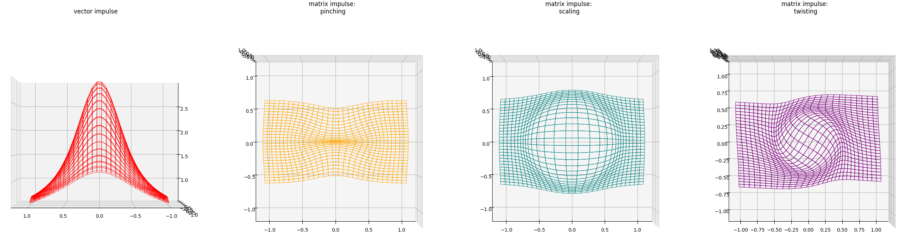

# GoGreen

This is a minimalist python implementation of my SIGGRAPH 2022 paper,
[*Go Green*: General Regularized Green’s Functions for
Elasticity](https://jiongchen.github.io/files/gogreen-paper.pdf).
